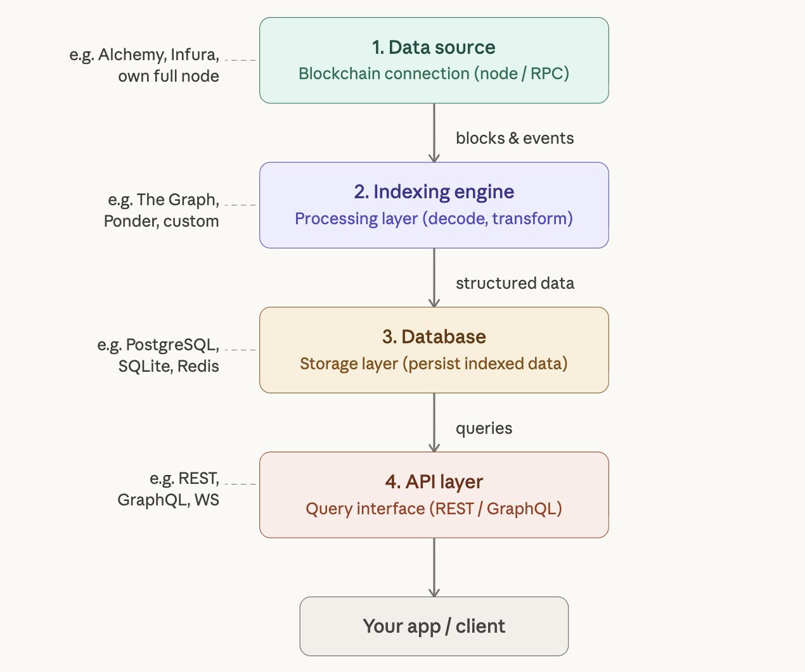

1. The data source(blockchain connection) ? => Alchemy(JSON-RPC and websocket)
2. Indexing engine(the processing layer) ? => 
3. Database (storage layer) ? => Postgres
4. API layer (query interface) ? => REST, GraphQL and websocket

